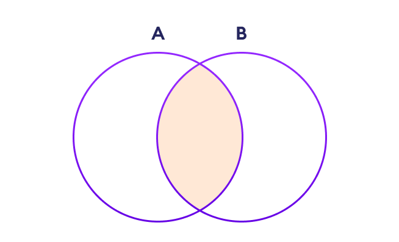

```python
# Python program explaining

# numpy.intersect1d() function

    

# importing numpy as geek 

import numpy as geek 

   

arr1 = geek.array([1, 1, 2, 3, 4])

arr2 = geek.array([2, 1, 4, 6])

   

gfg = geek.intersect1d(arr1, arr2)

   

print (gfg)

#[1 2 4]

```