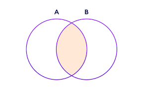

```python
np.setdiff1d(arr1, arr2, assume_unique=True)


 

# Python program explaining

# numpy.setdiff1d() function

   

# importing numpy as geek 

import numpy as geek 


arr1 = [5, 6, 2, 3, 4]
arr2 = [1, 2, 3]

  
gfg = geek.setdiff1d(arr1, arr2)

  

print (gfg)

#[4 5 6]

 ```
