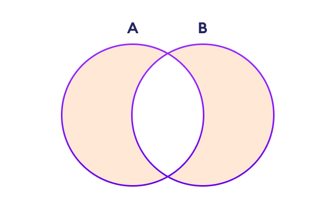

```python
np.setxor1d(arr1, arr2, assume_unique=True)


 

 

 

# Python program explaining

# numpy.setxor1d() function

   

# importing numpy as geek 

import numpy as geek 

  

arr1 = [1, 2, 3, 4]

arr2 = [2, 4, 6, 8]

  

gfg = geek.setxor1d(arr1, arr2)

  

print (gfg)

#[1 3 6 8]
```